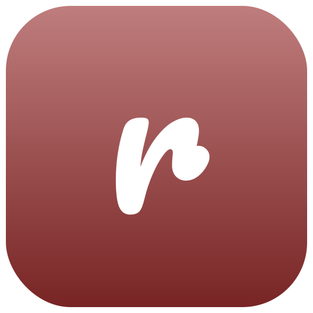
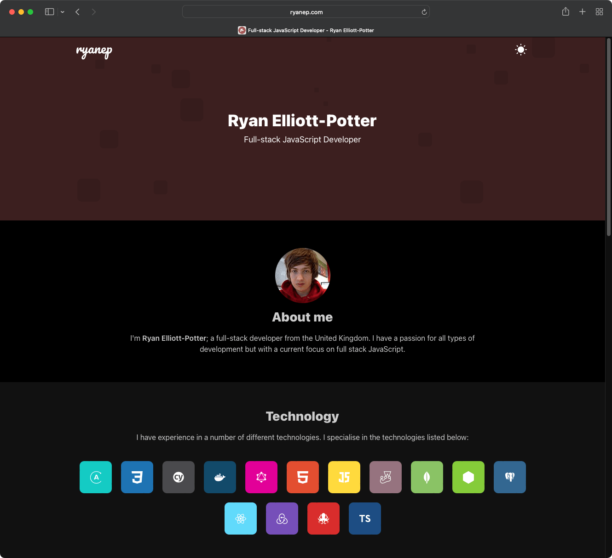

  

  <h1>Website</h1>
  
My static personal portfolio website.

## Introduction

This project is a personal portfolio built using React, Next.js and Tailwind CSS.

## Features

- Using Next.js App Router static export.
- Content managed via CMS using Contentful.
- Use of i18n for localisation.
- Fully typed, including generated GraphQL types.
- Components styling using Tailwind CSS.
- Terraform for infrastructure.

## Screenshot

## License

Licensed under the MIT license.
